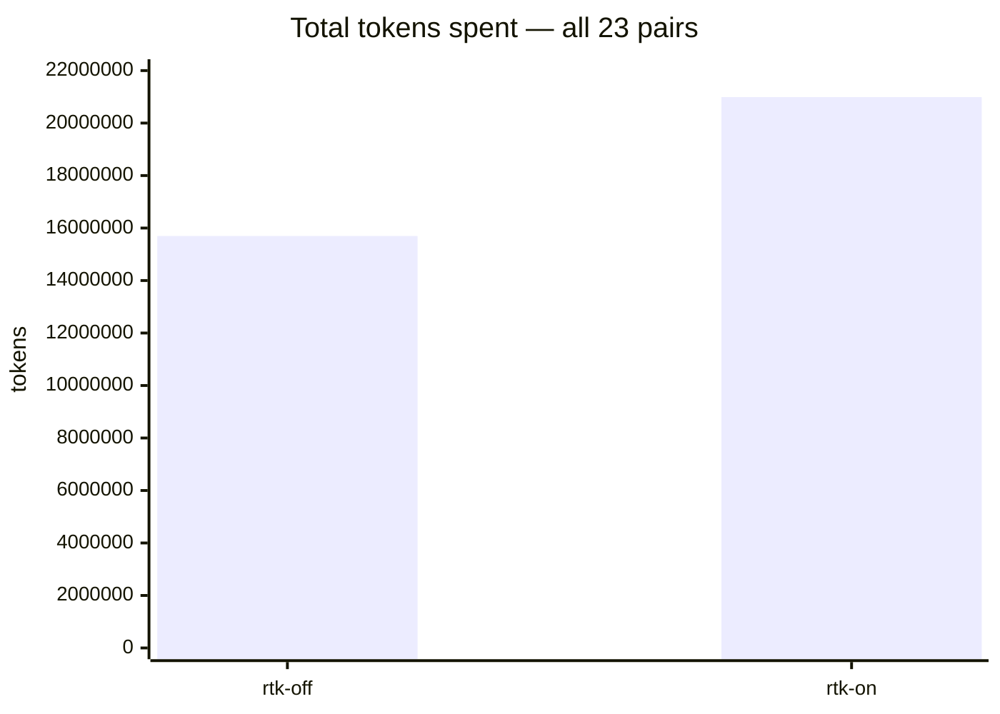
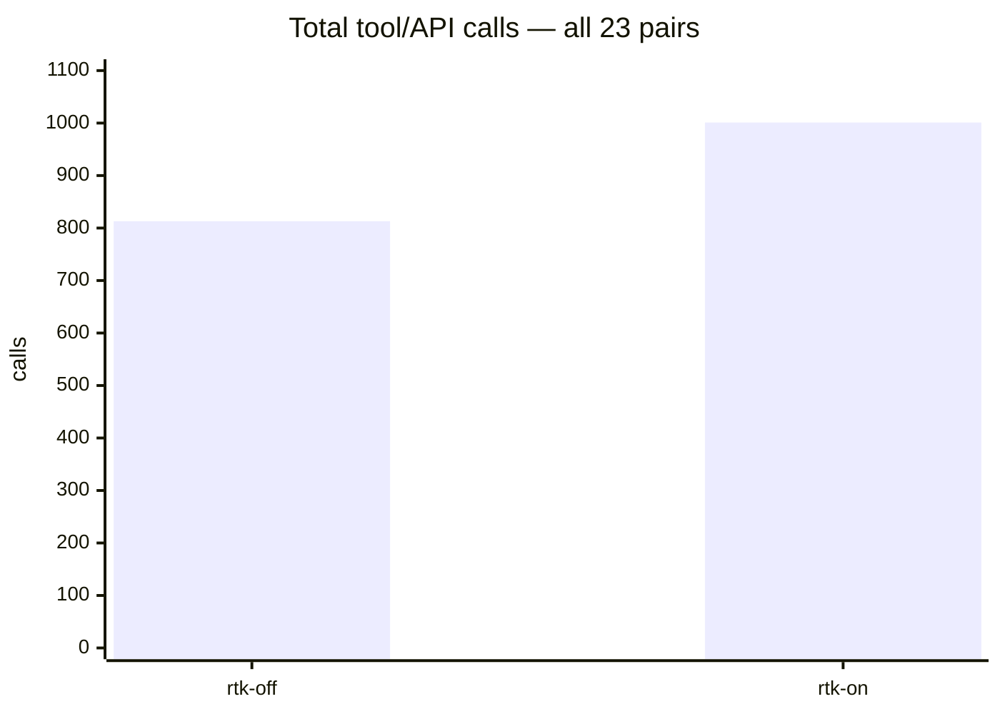

# RTK evaluation harness

This repo measures mini-swe-agent SWE-bench Lite runs with and without RTK command rewriting.

## Fair evaluation (current)

The initial evaluation (June 2026) hid RTK from the model — commands were silently rewritten with no awareness in the system prompt, no visibility of which commands got rewritten, and no escape hatch. This created a worst-case scenario that no real `rtk init -g` user would experience.

The fair evaluation mimics the real auto-rewrite hook:

- **Awareness**: The system prompt tells the model that RTK auto-rewrites commands (equivalent to the `RTK.md` file injected by `rtk init -g`).
- **Escape hatch**: `RTK_DISABLED=1 <cmd>` bypasses RTK for a single command — mirrors the real hook's env-var contract.
- **No preemptive exclusions**: No commands are excluded from rewrite. Whether the model reaches for `RTK_DISABLED=1` when output looks wrong is the key measurement. An optional `exclude_commands` config is available for preemptively-shielded comparison runs.

## Previous evaluation (June 2026 — UNFAIR)

The original eval ran 23 paired instances across 5 slices with silent rewriting. Results are preserved for reference but are not representative of real-world RTK usage:

| metric | rtk-off | rtk-on | delta |
|---|---:|---:|---:|
| Resolved | 18/23 | 17/23 | −1 |
| Total tokens | 15,696,536 | 20,989,751 | +33.7% |
| Total calls | 813 | 1,001 | +23.1% |

The main failure mode: pytest commands rewritten to `rtk pytest ...` produced repeated "No tests collected", and the model — unaware RTK was the cause — spent dozens of turns debugging the harness. See `logs/rtk_token_overuse_diagnosis_20260623.md`.

**Verdict on old eval**: invalid. The setup is not comparable to any real RTK integration.





Important interpretation: this is not caused by merely installing RTK. It is caused by putting RTK in the command path via our transparent `rtk rewrite` harness, which is similar to RTK's auto-rewrite hook behavior. Test-runner rewrites should be treated carefully or excluded.

## Repo contents

- `rtk_env.py` provides `RtkDockerEnvironment`, a mini-swe-agent Docker environment that runs `rtk rewrite` on each bash command and injects a Linux RTK binary into the SWE-bench container.
- `runs/measure_paired.py` compares token usage from paired `.traj.json` files.
- `logs/` contains evaluation summaries and diagnosis notes.

## Prerequisites

- Docker running locally.
- `mise` available, or equivalent Python 3.13 + `uv` setup.
- API credentials for the model provider you plan to use, configured for LiteLLM / mini-swe-agent.
- Host RTK installed on PATH (`rtk --version`). `mise install` installs `rtk 0.42.4` as configured in `mise.toml`.

## Setup

```bash
mise install
mise run install
```

Fetch/verify the Linux x86_64 RTK binary used inside SWE-bench Docker containers:

```bash
bash scripts/fetch-rtk-linux.sh
```

This should create:

```text
vendor/rtk-x86_64-unknown-linux-musl
```

## Run an A/B pair (fair evaluation)

Run from the repo root so `rtk_env.py` is importable and the relative `vendor/` RTK binary path resolves correctly.

### RTK off (control arm — unchanged)

```bash
python -m minisweagent.run.benchmarks.swebench \
  --subset lite --split test --slice 0:5 \
  --model anthropic/claude-sonnet-4-5-20250929 \
  --environment-class docker \
  -c swebench.yaml \
  -c agent.step_limit=100 \
  -c model.cost_tracking=ignore_errors \
  -o runs/rtk-off
```

### RTK on (fair arm — with awareness + bypass)

```bash
python -m minisweagent.run.benchmarks.swebench \
  --subset lite --split test --slice 0:5 \
  --model anthropic/claude-sonnet-4-5-20250929 \
  --environment-class rtk_env.RtkDockerEnvironment \
  -c swebench.yaml \
  -c swebench_rtk.yaml \
  -c model.cost_tracking=ignore_errors \
  -c environment.rtk_rewrite_log_path=runs/rtk-on/rtk_rewrite.log \
  -o runs/rtk-on
```

Key differences from the old (unfair) run:

- `swebench_rtk.yaml` is loaded AFTER `swebench.yaml` — it overrides `system_template` (RTK awareness) and `step_limit` (100 vs 250). `swebench.yaml` provides `instance_template`, `observation_template`, etc.
- The model is told about RTK's behavior, the pytest caveat, and `RTK_DISABLED=1` — but no commands are excluded. Whether the model reaches for the bypass is part of what we're measuring.
- Optionally add `-c environment.exclude_commands='["pytest"]'` to compare against a preemptively-shielded variant.

Swap `--model` as needed, for example `deepseek/deepseek-v4-flash` if your LiteLLM config supports it.

## Measure token usage

After both arms finish:

```bash
python runs/measure_paired.py \
  --off runs/example/rtk-off \
  --on runs/example/rtk-on
```

The script reads each trajectory's LiteLLM `usage` records and prints per-instance token/call deltas plus aggregate means/medians.

## Optional: grade with SWE-bench harness

mini-swe-agent writes predictions to each output dir. To evaluate resolved status locally:

```bash
python -m swebench.harness.run_evaluation \
  --dataset_name SWE-bench/SWE-bench_Lite \
  --split test \
  --predictions_path runs/example/rtk-off/preds.json \
  --run_id example-rtk-off \
  --report_dir logs/run_evaluation/example-rtk-off

python -m swebench.harness.run_evaluation \
  --dataset_name SWE-bench/SWE-bench_Lite \
  --split test \
  --predictions_path runs/example/rtk-on/preds.json \
  --run_id example-rtk-on \
  --report_dir logs/run_evaluation/example-rtk-on
```

## Important caveat

The old evaluation found that RTK's pytest rewriting caused serious problems (`Pytest: No tests collected` loops). In the fair evaluation:

- The model is warned about this in the system prompt and given `RTK_DISABLED=1` as a bypass.
- No commands are excluded by default — whether the model self-diagnoses and escapes is part of what we're measuring.
- A real user who encountered this would likely add `exclude_commands = ["pytest"]` to their config.toml. A follow-up run with exclusions pre-configured would measure the ceiling if the model doesn't self-rescue.

## Further reading

- `docs/using-rtk-with-harness.md` — implementation detail on how the harness integrates with mini-swe-agent.
- `logs/rtk_token_overuse_diagnosis_20260623.md` — diagnosis of old unfair eval's failure modes.
